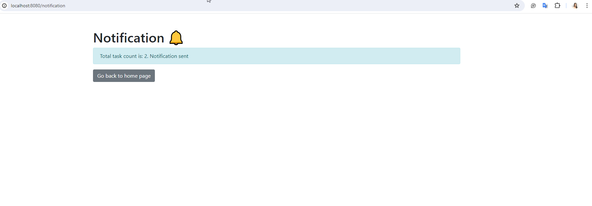
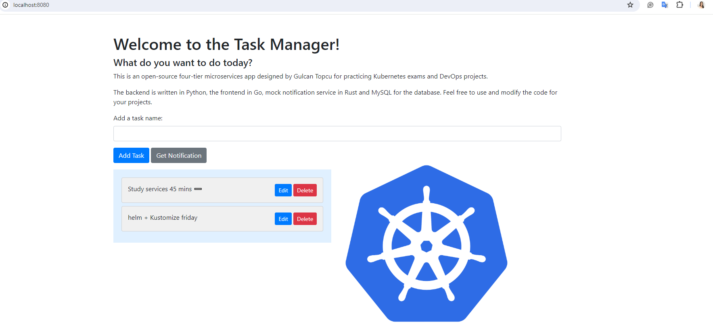

# Simple Microservices App to get CKAD certified

This is a guide to set up a simple 4 tier microservices architecture for the CKAD certification project. The architecture uses Go for the UI, Python for the backend CRUD operations, Rust for mock notifications and MySQL for the database.

 



## Setting up the database and user permissions

First, pull the MySQL Docker image and run the container:

```bash
docker pull mysql:latest
docker run --name mysql-container -e MYSQL_ROOT_PASSWORD=colo -d mysql:latest
```

To create a database (ckad_crud), a user (colo) with access to that database, and grant all privileges on the database, execute the following commands:

```bash
docker exec -it mysql-container mysql -uroot -p

CREATE DATABASE ckad_crud;
CREATE USER 'colo'@'%' IDENTIFIED BY 'colo';
GRANT ALL PRIVILEGES ON ckad_crud.* TO 'colo'@'%';
FLUSH PRIVILEGES;

USE ckad_crud;

CREATE TABLE users (
    id INT AUTO_INCREMENT PRIMARY KEY,
    name VARCHAR(255) NOT NULL,
    email VARCHAR(255) NOT NULL,
    phone VARCHAR(255) NOT NULL
);

CREATE TABLE tasks (
    id INT AUTO_INCREMENT PRIMARY KEY,
    taskName VARCHAR(255) NOT NULL
);

```

## Setting up Rust

[Install Rust:](https://www.rust-lang.org/tools/install)

`curl --proto '=https' --tlsv1.2 -sSf https://sh.rustup.rs | sh`

## Setting up Go

Install Go:

```bash
wget https://go.dev/dl/go1.22.2.linux-amd64.tar.gz
rm -rf /usr/local/go && tar -C /usr/local -xzf ~/go1.22.2.linux-amd64.tar.gz
export PATH=$PATH:/usr/local/go/bin
go version
```

Initialize the Go module and install the Gin web framework:

```bash
go mod init ckad
go mod tidy
go get -u github.com/gin-gonic/gin
```

Set up environment variables for MySQL configuration:

```bash
export MYSQL_ROOT_PASSWORD=colo
export MYSQL_DATABASE=ckad_crud
export MYSQL_DB=ckad_crud
export MYSQL_USER=colo
export MYSQL_PASSWORD=colo
export MYSQL_PORT=3306
export MYSQL_HOST=mysql

echo $MYSQL_ROOT_PASSWORD, $MYSQL_DATABASE, $MYSQL_USER, $MYSQL_PASSWORD, $MYSQL_PORT
```

## Running the microservices using docker compose

Use Docker Compose to orchestrate the containers for the microservices:

```bash
cd 4-tier-todo-app/app
docker-compose up --build
```

This will start the Python microservice for backend CRUD operations, Rust for the mock notification service, the MySQL database, and the Go UI microservice. The Python microservice should be running separately from the Go UI microservice to achieve the microservices architecture.


## Running todo app using manifest files


```sh
cd 4-tier-todo-app/app/manifests
k apply -f ./manifests
```