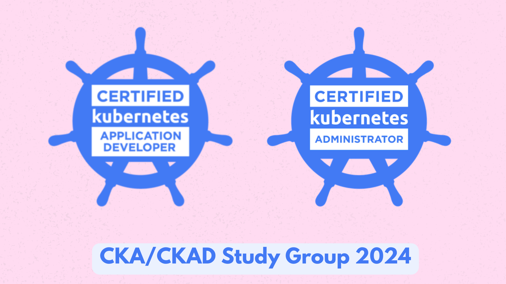

# CKA/CKAD Study Group Repository 🚀

Welcome to our **CKA/CKAD** study group repository! 🚀 This space is dedicated to collaborative learning and preparation for the Certified Kubernetes Administrator (CKA) and Certified Kubernetes Application Developer (CKAD) exams.




## Table of Contents

- [Getting Started](#getting-started)
- [Curriculum](#curriculum)
- [Scenarios](#scenarios)
- [Study Materials](#study-materials)
- [Contributing](#contributing)
- [License](#license)

## Getting Started

### Clone the Repository

   ```bash
   git clone https://github.com/colossus06/cka-ckad-study-group.git
   ```

   Clone this repository to your local machine to access study materials, practice scenarios, and other resources.

### CKAD Curriculum

* **20%: Application Design and Build**
   
   * Define, build and modify container images
   * Choose and use the right workload resource (Deployment, DaemonSet, CronJob, etc.)
   * Understand multi-container Pod design patterns (e.g. sidecar, init and others)
   * Utilize persistent and ephemeral volumes
     
* **20%: Application Deployment**

   * Use Kubernetes primitives to implement common deployment strategies (e.g. blue/green or canary)
   * Understand Deployments and how to perform rolling updates
   * Use the Helm package manager to deploy existing packages
   * Kustomize
     
* **15%: Application Observability and Maintenance**

   * Understand API deprecations
   * Implement probes and health checks
   * Use built-in CLI tools to monitor Kubernetes applications
   * Utilize container logs
   * Debugging in Kubernetes
     
* **25%: Application Environment, Configuration and Security**

   * Discover and use resources that extend Kubernetes (CRD, Operators)
   * Understand authentication, authorization and admission control
   * Understand Requests, limits, quotas
   * Understand ConfigMaps
   * Define resource requirements
   * Create & consume Secrets
   * Understand ServiceAccounts
   * Understand Application Security (SecurityContexts, Capabilities, etc.)
     
* **20%: Services & Networking**

   * Demonstrate basic understanding of NetworkPolicies
   * Provide and troubleshoot access to applications via services
   * Use Ingress rules to expose applications

### CKA Curriculum

* Storage **10%**
   * Understand storage classes, persistent volumes
   * Understand volume mode, access modes and reclaim policies for volumes
   * Understand persistent volume claims primitive
   * Know how to configure applications with persistent storage
     
* Troubleshooting **30%**
   * Evaluate cluster and node logging
   * Understand how to monitor applications
   * Manage container stdout & stderr logs
   * Troubleshoot application failure
   * Troubleshoot cluster component failure
   * Troubleshoot networking
     
* Workloads & Scheduling **15%**
   * Understand deployments and how to perform rolling update and rollbacks
   * Use ConfigMaps and Secrets to configure applications
   * Know how to scale applications
   * Understand the primitives used to create robust, self-healing, application deployments
   * Understand how resource limits can affect Pod scheduling
   * Awareness of manifest management and common templating tools
     
* Cluster Architecture, Installation & Configuration **25%**
   * Manage role based access control (RBAC)
   * Use Kubeadm to install a basic cluster
   * Manage a highly-available Kubernetes cluster
   * Provision underlying infrastructure to deploy a Kubernetes cluster
   * Perform a version upgrade on a Kubernetes cluster using Kubeadm
   * Implement etcd backup and restore
     
* Services & Networking **20%**
   * Understand host networking configuration on the cluster nodes
   * Understand connectivity between Pods
   * Understand ClusterIP, NodePort, LoadBalancer service types and endpoints
   * Know how to use Ingress controllers and Ingress resources
   * Know how to configure and use CoreDNS
   * Choose an appropriate container network interface plugin

### KCNA Curriculum
<!-- todo ADD kcna curriculum and domain weights like in the ckad curriculum -->


### Scenarios Hands-on Learning

* [Core Skills-Part I](https://github.com/colossus06/cka-ckad-study-group-2024/blob/main/week-II-scenarios/1-core-skills-general.md)
* [Core Skills-Part II]()

### Join the Study Group

   - For discussions, Q&A, and collaborative learningJoin our
      - CKA [study group](https://chat.whatsapp.com/FnRKwQrJ1L71JfGd3a7eGD)
      - CKAD [study group](https://chat.whatsapp.com/ClwWPDEp83bLZgamnIRFjJ)


   Connect with fellow learners, ask questions, and participate in discussions related to CKA/CKAD exam preparation.

### Set Up Your Environment
   - Follow the instructions in the [week I setup](https://github.com/colossus06/cka-ckad-study-group-2024/tree/main/week-I-cluster-setup) guide to configure your Kubernetes environment for studying. Deploy a sample 3 Tier App following [ Week II instructions](https://github.com/colossus06/cka-ckad-study-group-2024/tree/main/week-II-3-tier-app-setup)

   Ensure you have a suitable Kubernetes environment for hands-on practice and labs by following the provided setup instructions.

#### Study Materials

You can find resources and materials we are going to follow in our slack channell.

#### Contributing

We encourage you to contribute to the repository by:

- Adding more study materials.
- Creating additional practice scenarios.
- Sharing your experience and tips.
- Reporting issues or improvements.

## License

This repository is licensed under the [MIT License](./LICENSE).


## Keep a Journal to Share your Journey

- [ ] [Week 1](journal/week-1.md)
- [ ] [Week 2](journal/week1.md)
- [ ] [Week 3](journal/week1.md)
- [ ] [Week 4](journal/week1.md)
- [ ] [Week 5](journal/week1.md)
- [ ] [Week 6](journal/week1.md)
- [ ] [Week 7](journal/week1.md)
- [ ] [Week 8](journal/week1.md)
- [ ] [Week 9](journal/week1.md)
- [ ] [Week 10](journal/week1.md)
