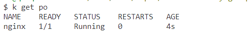
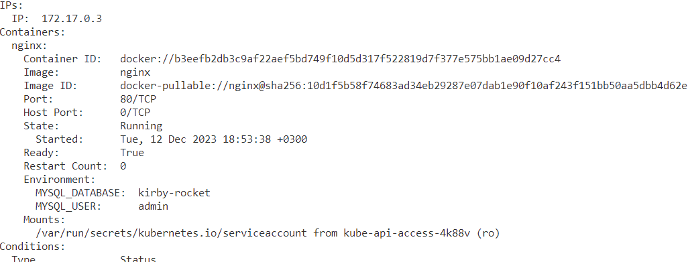
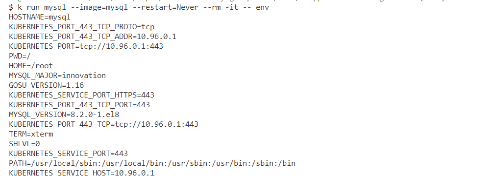
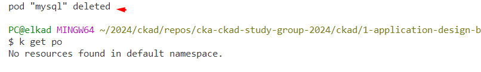
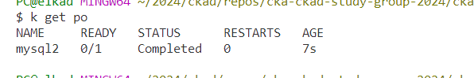
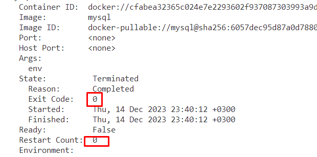

## Tasks

**Duration: 10 mins**

**1-)** You have a running pod named nginx. Add the following environment variables to nginx: MYSQL_DATABASE=kirby-rocket and MYSQL_USER=admin. Delete all the status info. Validate that the variables are set correctly using kubectl descibe command.

<span style="color:green;">
<details closed>
  <summary>
  Answer
  </summary>

```bash
k get po nginx -oyaml > edit-po.yaml
k delete po nginx
k apply -f edit-po.yaml
k describe po nginx

```

after adding the environment variables, delete the pod and recreate it using the manifest.






</details>
</span>

<br>


**2-)** Run a pod named mysql using mysql image, don't restart it, get a shell that displays the environment variables and delete the pod when it is completed. 

<span style="color:green;">
<details closed>
  <summary>
  Answer
  </summary>

```bash
k run mysql --image=mysql --restart=Never --rm -it -- env
```






</details>
</span>

<br>


**2-)** Run a pod named mysql2 using mysql image, don't restart it, sen MYSQL_ROOT_PASSWORD value to `psw`, get a shell that displays the environment variables. Verify the restart count and exit code.

<span style="color:green;">
<details closed>
  <summary>
  Answer
  </summary>

```bash
k run mysql2 --image=mysql --restart=Never --env=MYSQL_ROOT_PASSWORD=psw -it -- env
```






</details>
</span>

<br>