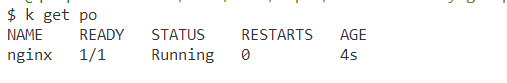

## Tasks

**Duration: 10 mins**

**1-)** You have a running pod named nginx. Add the following environment variables to nginx: MYSQL_DATABASE=kirby-rocket and MYSQL_USER=admin. Delete all the status info. Validate that the variables are set correctly using kubectl descibe command.

<span style="color:green;">
<details closed>
  <summary>
  Answer
  </summary>

```bash
k get po nginx -oyaml > edit-po.yaml
k delete po nginx
k apply -f edit-po.yaml
k describe po nginx

```

after adding the environment variables, delete the pod and recreate it using the manifest.




</details>
</span>

<br>