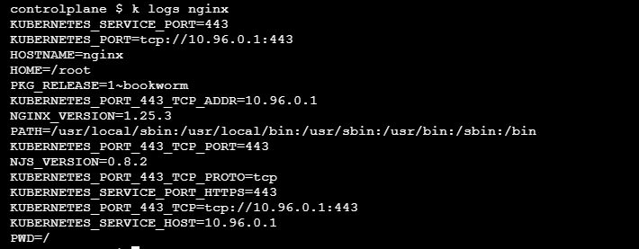
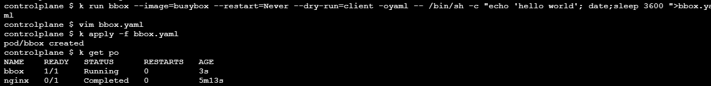
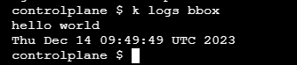

# Application Design and Build


The first domain in the exam is Application Design and Build having a 20% weight. Before moving on to the next domain make sure that you're fluent with the following. 


- [x] storage and definition in pods and multiple containers
- [x] batch, periodic workloads

## Achivements

* getting a shell in the container(`k exec -it <pod-name> -- /bin/bash`)
* run a command in the container without getting a shell(`k exec <pod-name> -- date`)


## Tasks

**Duration: 10 mins**

**1-)** Create an nginx pod using YAML that runs the command "env" and display the logs.

<span style="color:green;">
<details closed>
  <summary>
  Answer
  </summary>

```bash
k run nginx --image=nginx --restart=Never --dry-run=client -oyaml -- env >nginx.yaml
k logs nginx

```



</details>
</span>

<br>


**2-)** Create a busybox pod named bbox pod using YAML that runs the command "hello world", display the date and then sleep for 3600 seconds. Lastly display the logs.

<span style="color:green;">
<details closed>
  <summary>
  Answer
  </summary>

```bash
k run bbox --image=busybox --restart=Never --dry-run=client -oyaml -- /bin/sh -c "echo 'hello world'; date;sleep 3600 ">bbox.ya
ml
```





</details>
</span>

<br>

**3-)**
Create a Kubernetes Pod named "loop" in the "true-b" namespace. The Pod runs a container using the "busybox" image, with a looping script echoing "Hello $i times" for values of i from 1 to 10.

<span style="color:green;">
<details closed>
  <summary>
  Answer
  </summary>

```bash
k create ns true-b
kubectl run loop --image=busybox \
  -n true-b $do --restart=Never \
  --command --  'for i in $(seq 1 10); \
  do echo "Hello $i times"; done' > pod.yaml
```

</details>
</span>

<br>


**3-)**
Run an nginx pod named `ng` living in `mynamespace` ns. Don't restart it if it exits. Get a shell inside the container and display the environment variables.

<span style="color:green;">
<details closed>
  <summary>
  Answer
  </summary>

```bash
k config set-context --current --namespace=mynamespace
k run ng --image=nginx --restart=Never -it -- /bin/sh
env

```

</details>
</span>

<br>
