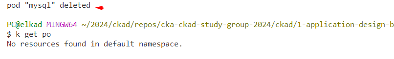
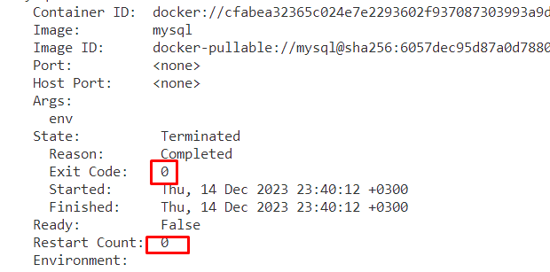

## Achivements

* getting a shell in the container
* defining commands with arguments on the running pod
* adding environment variables to a live pod
* running containers that don't restart
* stream the logs (`k logs <pod-name> -f`)
* download the logs of a previous container(`k logs <pod-name> -p`)

## Tasks

**Duration: 10 mins**

**1-)** You have a running pod named nginx. Add the following environment variables to nginx: MYSQL_DATABASE=kirby-rocket and MYSQL_USER=admin. Delete all the status info. Validate that the variables are set correctly using kubectl descibe command.

<span style="color:green;">
<details closed>
  <summary>
  Answer
  </summary>

```bash
k get po nginx -oyaml > edit-po.yaml
k delete po nginx
k apply -f edit-po.yaml
k describe po nginx

```

after adding the environment variables, delete the pod and recreate it using the manifest.


</details>
</span>

<br>


**2-)** Run a pod named mysql using mysql image, don't restart it, get a shell that displays the environment variables and delete the pod when it is completed. 

<span style="color:green;">
<details closed>
  <summary>
  Answer
  </summary>

```bash
k run mysql --image=mysql --restart=Never --rm -it -- env
```





</details>
</span>

<br>


**2-)** Run a pod named mysql2 using mysql image, don't restart it, set MYSQL_ROOT_PASSWORD value to `psw`, get a shell that displays the environment variables. Verify the restart count and exit code.

<span style="color:green;">
<details closed>
  <summary>
  Answer
  </summary>

```bash
k run mysql2 --image=mysql --restart=Never --env=MYSQL_ROOT_PASSWORD=psw -it -- env
```





</details>
</span>

<br>


**3-)** Create pod named cka using bitnami/nginx image imperatively. Observe the running pod's environment variables available to the runtime. Add the following environment variables: DB_USERNAME=adminuser, DB_URL=sql://db:1433. Get a shell into the container and verify the available runtime env variables.

<span style="color:green;">
<details closed>
  <summary>
  Answer
  </summary>

```bash
k run cka --image=bitnami/nginx
k exec cka -- env
k get po cka -oyaml > editnginx.yaml
k delete po cka

```


</details>
</span>

<br>


**4-)** Run a busybox pod named multi-command-pod that runs the command Hello, World!, that doesn't restart. Once you see completed in the status column, download the logs and verify that the command executed succesfully. Edit the pod to display the date and sleep for 3600 seconds. Verify that the pod is still running, not completed.

<span style="color:green;">
<details closed>
  <summary>
  Answer
  </summary>

```bash
k run multi-command-pod --image=busybox --restart=Never -- /bin/sh -c "echo 'Hello study group'"

k get po multi-command-pod -oyaml > multi.yaml
k delete po multi-command-pod
k apply -f multi.yaml


```


</details>
</span>

<br>