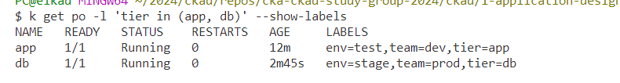

## Achivements

We aim to achieve the following:
* creating, modifying existing labels and annotations
* selecting labels
 

## Tasks

**Duration: 10 mins**

**1-)** Run a pod from the manifest file named label using image alpine, assign the label env=test, tier=backend. Display the assigned labels.

<span style="color:green;">
<details closed>
  <summary>
  Answer
  </summary>

```bash
k run label --image=alpine --labels=env=test,tier=backend --restart=Never --dry-run=client -oyaml > label.yaml
k apply -f label.yaml
k get po --show-labels
```


</details>
</span>

<br>

**2-)** Change the pod's label env=test to env=QA imperatively.

<span style="color:green;">
<details closed>
  <summary>
  Answer
  </summary>

```bash
k label po label env=QA --overwrite
k get po --show-labels
```


</details>
</span>

<br>

**3-)** Remove env=QA and add team=dev imperatively.

<span style="color:green;">
<details closed>
  <summary>
  Answer
  </summary>

```bash
k label po label team=dev env-
k get po --show-labels
```


</details>
</span>

<br>

**4-)** Run another pod named app using nginx image, assing the labels env=test,team=dev,tier=app. Query the pods having tier=backend label.

<span style="color:green;">
<details closed>
  <summary>
  Answer
  </summary>

```bash
k run app --image=nginx --labels=env=test,tier=app,team=dev --restart=Never
k get po -l tier=backend --show-labels
```


</details>
</span>

<br>


**5-)** Run another pod named DB using mysql image, assing the labels env=stage,team=prod,tier=db. Query the pods having tier value equal to either app or db.

<span style="color:green;">
<details closed>
  <summary>
  Answer
  </summary>

```bash
k run db --image=mysql --env=MYSQL_ROOT_PASSWORD=pass --labels=env=stage,team=prod,tier=db --restart=Never
k get po -l 'tier in (app, db)' --show-labels
```





</details>
</span>

<br>


**6-)** Create a pod named annt using the image nginx. Assign yourself as author, project='Study Group' as annotation to app pod. Display the current labels and annotations of the pod app. Lastly, remove the project annotation.

<span style="color:green;">
<details closed>
  <summary>
  Answer
  </summary>

```bash
k run po annt --image=nginx --dry-run=client -oyaml > annt.yaml
k apply -f annt.yaml
k describe po annt
k annotate po annt project-
k describe po annt
```


</details>
</span>

<br>