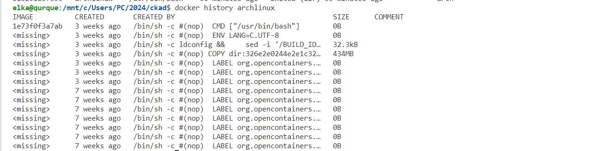

# Application Design and Build

- [Docker Prerequisites]()
- [Best Practices for writing Dockerfiles]()

The first domain in the exam is Application Design and Build having a 20% weight. Before moving on to the next domain make sure that you're fluent with the following. 

- [x] Understand, use and manage containers(registires, logging, exiting a container, ps aux, )
- [x] Container image architecture (tar file, layers, base image, how to reduce layers, showing the layer history, tagging )
- [x] Writing a dockerfile (don't use multiple RUN commands rather connect them &&, using backslashes, using docker commit)


```sh
docker image ls
docker image rm
docker history <imageid> OR image:tag
docker tag <current-image> <target-registry or whatever you want>
docker build -t
docker commit
docker save -o myimage.tar
```




### Questions

* What is the default entrypoint of a dockerfile?
* How can you create a custom container image?

### Best Practices for writing Dockerfiles

**1. Use a Smaller Base Image:**

Consider using a smaller base image (e.g., Alpine) to reduce the image size at the outset.

*WHY*: Choosing a smaller base image, like Alpine, significantly reduces the initial image size. Smaller base images contain only essential components, minimizing the overall image footprint and speeding up builds.

```bash
# Before
FROM ubuntu
```

```bash
# After (Using Alpine)
FROM alpine
```

**2. Avoid Debug Tools in Production:**

*WHY*: Install debugging tools only during development to prevent unnecessary increases in image size. Debugging tools are often unnecessary in production and can inflate image sizes significantly. Install them only during development for troubleshooting purposes.

```bash
# Before
RUN apt-get update && apt-get install -y curl vim
```

```bash
# After (Install only in development)
RUN apk add --no-cache curl vim
```

**3. Minimize Layers:**

*WHY*: Combining commands into a single RUN statement helps reduce the number of layers, optimizing the image size. Each RUN command creates a new layer in the image. Reducing layers not only simplifies the Dockerfile but also minimizes the image size and enhances build performance.

```bash
# Before
FROM alpine
RUN apk add --no-cache packageA
RUN apk add --no-cache packageB
```

```bash
# After (Combine in one RUN command)
FROM alpine
RUN apk add --no-cache packageA packageB
```

**4. Use `--no-install-recommends` on apk:**

*WHY*: Reduce image size by excluding recommended packages during installation. Recommended packages are often unnecessary for the intended use of the image. Omitting them during installation contributes to a leaner image.

```bash
# Before
RUN apk add --no-cache some-package
```

```bash
# After (with --no-install-recommends)
RUN apk add --no-cache --no-progress --purge --clean-protected some-package
```

**5. Clean Up After Install:**

*WHY*: Removing temporary files and package caches after installation helps keep the image size minimal and avoids unnecessary bloat. Installing tools for specific tasks and removing them immediately after use helps maintain a slim image without unnecessary components.

```bash
# After apk add
RUN apk add --no-cache wget \
    && rm -rf /var/cache/apk/*
```

```bash
# After wget or curl installation
RUN apk add --no-cache wget \
    && wget https://example.com/some-package.deb \
    && dpkg -i some-package.deb \
    && apk del wget
```

**6. Utilize fromlatest.io:**

*WHY*: Use fromlatest.io as an external tool to lint Dockerfiles for additional size reduction steps. External tools like fromlatest.io analyze Dockerfiles for potential improvements, helping identify additional steps to reduce image size. Regular linting contributes to ongoing optimization efforts.

**7. Implement Multi-Stage Builds:**

*WHY*: Use multi-stage builds to keep the final image focused on necessary artifacts, reducing overall image size. Multi-stage builds allow for separation of build and runtime environments. The final image contains only essential artifacts, resulting in a smaller and more efficient container.

```bash
# Before (Single-Stage)
FROM alpine
```

```bash
# After (Multi-Stage)
FROM alpine as builder
RUN build-command

FROM alpine as base
COPY --from=builder /path/to/artifact /app/
```