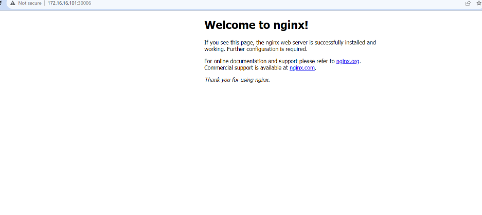

# CKAD Study Journal


# Week I

Started a study group with 5 people. 

On the first week, the biggest challenge we faced was setting up a production grade vanilla Kubernetes environment. Sure we had some options like kind, minikube, k9s and we chosed kubeadm v1.26 :) We deployed a 3 node clean K8s cluster using:

* vagrant
* vb

Deployed an nginx pod and service before pushing the setup to the CKA/CKAD 2024 study group repo:




**Task 1**: Persist Vim settings in .vimrc. These settings define how Vim should behave and display text. The following settings will be configured on the exam day, let's make your local development environment reflect those changes:

`vim ~/.vimrc`

```sh
set expandtab # to use spaces for indenting lines
set tabstop=2 # to insert 2 spaces before a line indent
set shiftwidth=2 # to add-remove indentation using >> or << operators
syntax enable # providing colorization
set smartindent #smart autoindenting when starting a new line
set autoindent # Enables automatic indentation based on the previous line
set ruler # Displays the line and column number of the cursor position
set softabstop
```


So i'm going with these: 

```sh
set et ai nu sw=2 ts=2
```


**Task 2**- To display all and current context, created some scenarios testing the core skills [here](https://github.com/colossus06/cka-ckad-study-group-2024/blob/main/week-II-scenarios/1-core-skills-general.md)


When you run `k config -h` you get the available useful sub commands: 

```sh
current-context   Display the current-context
delete-cluster    Delete the specified cluster from the kubeconfig
delete-context    Delete the specified context from the kubeconfig
delete-user       Delete the specified user from the kubeconfig
get-clusters      Display clusters defined in the kubeconfig
get-contexts      Describe one or many contexts
get-users         Display users defined in the kubeconfig
rename-context    Rename a context from the kubeconfig file
set               Set an individual value in a kubeconfig file
set-cluster       Set a cluster entry in kubeconfig
set-context       Set a context entry in kubeconfig
set-credentials   Set a user entry in kubeconfig
unset             Unset an individual value in a kubeconfig file
use-context       Set the current-context in a kubeconfig file
view              Display merged kubeconfig settings or a specified kubeconfig file
```

So when I run `k config get-contexts` you see that all three contexts are pointing to different clusters. And all the contexts connect to the default namespace. 


**Task 3**- Create a Pod with Resource Requests and Limits

Before copy and paste from official documents, type `set: paste` to keep indentation tidy, otherwise it may pull your hair off :)


Once you see the container running, let's verify that it is actually running.


We see that the bitnami/nginx container is running. 


## Key Learnings

* I started to think that vim is easier than nano. Completely adopted vim not just for the sake of the exam, but also for daily use.
* settin paste and `set et ai nu sw=2 ts=2` is more than enough for a stable, persistent .vimrc
* Happy that i finally started the curriculum and bought the exam, just start and you will be fine.
* There are some outdated rosources, labs, follow the latest ones or adapt them.
