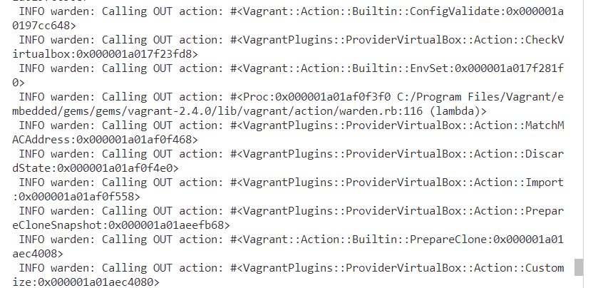
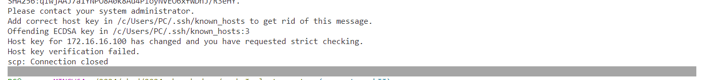
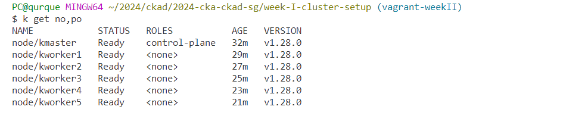
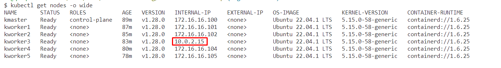
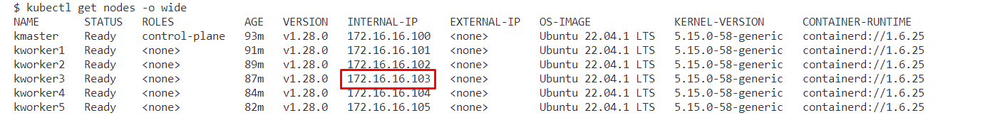
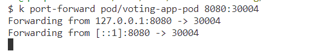
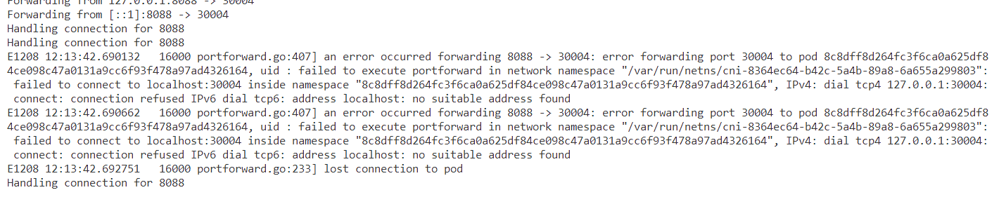
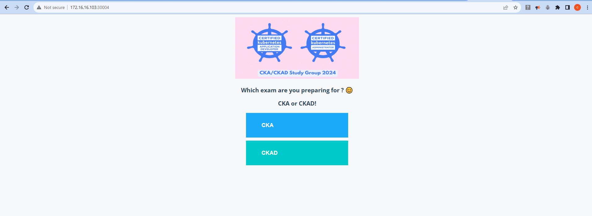
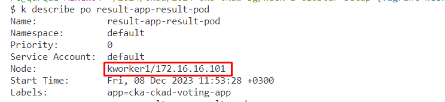

# CKAD Study Journal

## Week II

This week i finally started studying the CKAD curriculum's first domain and deployed 2 sample multi-tier apps using

* docker compose
* minikube
* kubeadm

## Adding 3 more vms to the week I cluster

Had difficulty in adding 3 more vms to the existing vagrant configuration. Kept getting the following error:

`INFO warden: Calling OUT action: #<Proc:0x000001a01bb591b0 C:/Program Files/Vagrant/embedded/gems/gems/vagrant-2.4.0/lib/vagrant/action/warden.rb:116 (lambda)>
 INFO warden: Calling OUT action: #<Vagrant::Action::Builtin::Provision:0x000001a01b21a8d8>`



## Fixing the ip of the kworker3

Got the Host key verification failed. error, fixed it by clearing the .ssh/known_hosts file







My kworker3 had a different ip than the one in the /ect/hosts file

`Environment="KUBELET_EXTRA_ARGS=--node-ip=172.16.16.103"`

`k port-forward service/voting-service 80:voting-service
kubectl port-forward pod/voting-app-pod 80:30004`




Added the node ip and run the following:

```
systemctl daemon-reload
systemctl restart kubelet
```




Voila! this solved the issue :)





Oh, there comes another issue:

`connection refused IPv6 dial tcp6: address localhost: no suitable address found`



Let's try displaying using the node ip before diving in debugging the issue. Time is precious right? ⌛

After identifying which node my pod is running on:



The nodejs app is also running on kworker1:



## Key Learnings

* Remember that you don't necessarily need to use `kubectl port-forward` if you are using a `NodePort` service, as NodePort exposes the service on a static port on each node in the cluster.

* Vagrant snapshots helps me manage my time efficiently. 
* Working with time constraints is a great challenge, and it often requires prioritization, efficient and focused planning. Just a simple sticky note has proven to be more efficient than a great dotted notebook.

## General Notes on Containers

**exit codes**

* Docker isn't support on RedHat anymore, you need podman and it is installed by default or as an alternative install docker on ubuntu.
* After editing privileges, you don't need to log out and log in to verify the new settings. You can use `newgroup ` + <your-user> to get a new shell.

```sh
sudo usermod -aG docker $USER
newgrp docker
```

* ctrl+d, exit will stop the application, you should use ctrl+p, ctrl+q to disconnect shell.
* a quick clarification on exit codes.. 0 is what we expect, so it means it is succesfull. Anything other than 0 indicates command failed with exit code $?.

Let's run a busybox container, get a shell and exit. We will see that main application run without error.


Let's try a nodejs container that has a db dependency and stop:


Any number bigger than 128 indicates a termination signal, we sent SIGTERM explicitly by running `docker stop`


So SIGTERM is a polite way to stop a container gracefully. You can use SIGKILL if the container doesn't respond to a graceful stop request.

* To inspect a container, use `docker inspect` with `| less` and search the term using `/search-term` adding `-i` for case insensitive search, moving between the pages using `space` and `b` for back a page, exiting with `q`.

**docker logs**

Let's run a mysql container and see what can go wrong and how we can inspect the logs.


Ha! Sure we need env variables. Now we know how to fix it:

`docker run --name mysql -e MYSQL_ROOT_PASSWORD=my-secret -d mysql`

Get the last five entry in the logs of mysql container:


