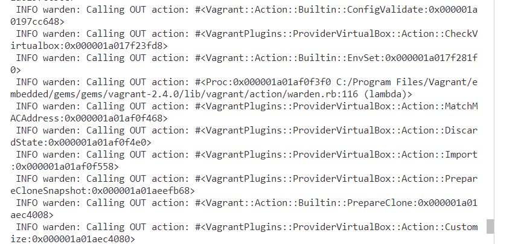

# CKAD Study Journal

## Week II

This week i finally started studying the CKAD curriculum's firs domain and deploy 2 sample multi-tier apps using

* docker compose
* minikube

Had difficulty in adding 3 more vms to the existing vagrant configuration. Kept getting the following error:
 INFO warden: Calling OUT action: #<Proc:0x000001a01bb591b0 C:/Program Files/Vagrant/embedded/gems/gems/vagrant-2.4.0/lib/vagrant/action/warden.rb:116 (lambda)>
 INFO warden: Calling OUT action: #<Vagrant::Action::Builtin::Provision:0x000001a01b21a8d8>

## Debugging the 

## Key Learnings