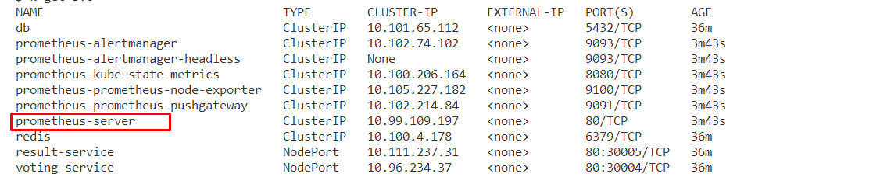
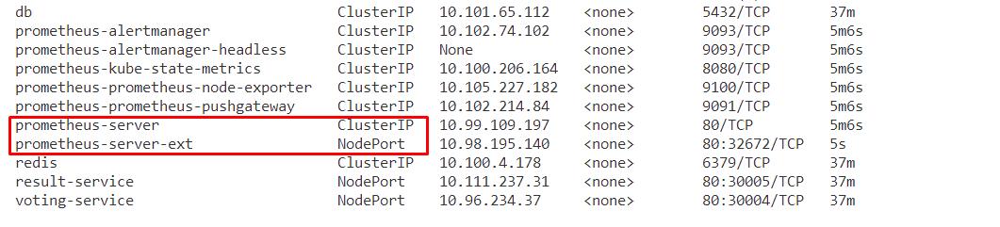

# Setting up a Vanilla Kubernetes Cluster with 1 Master and 2 Worker Nodes

## Managing the Cluster from Your Host Machine

One of the conveniences of this setup is the ability to manage the Kubernetes cluster directly from your host machine without SSHing into the master. Follow these steps:

```bash
rm -rf .kube
sudo vim /etc/hosts
```

Add the following entries to your `/etc/hosts` file:

```plaintext
172.16.16.100   kmaster.example.com     kmaster
172.16.16.101   kworker1.example.com    kworker1        
172.16.16.102   kworker2.example.com    kworker2
172.16.16.103   kworker1.example.com    kworker3       
172.16.16.104   kworker2.example.com    kworker4
172.16.16.105   kworker2.example.com    kworker5 
```

```
mkdir -p $HOME/.kube
```

Now, copy the Kubernetes configuration to your local machine:

```bash
scp root@172.16.16.100:/etc/kubernetes/admin.conf ~/.kube/config
```
pasword is kubeadmin :)


Testing the config file: 

```bash
alias k=kubectl
k get all
```


Revive your containers using vagrant up: 

Copy your .kube config using scp:


Let's deploy the using pod and service objects one by one:


* 1-**python app**
* 2-**redis**
* 3-**psql**
* 4-**worker**
* 5-**result pod and service objects**

run `voting-app-automated.sh`

```sh
k config set-context --current --namespace=monitoring
./monitoring-stack.sh
./voting-app-automated.sh
k port-forward prometheus-prometheus-prometheus-0 8080:9090 -n monitoring
```



Displaying prometheus server UI:





**Access Grafana locally using port-forwarding:**

```bash
kubectl port-forward <grafana-pod> 52222:3000
```


</br>

prometheus server URL: `http://prometheus-prometheus.monitoring:9090/`


## fixing kworker3 node ip

```sh
vagrant ssh kworker3
sudo -i
vim /etc/systemd/system/kubelet.service.d/10-kubeadm.conf
Environment="KUBELET_EXTRA_ARGS=--node-ip=172.16.16.103"
systemctl daemon-reload
systemctl restart kubelet
```


