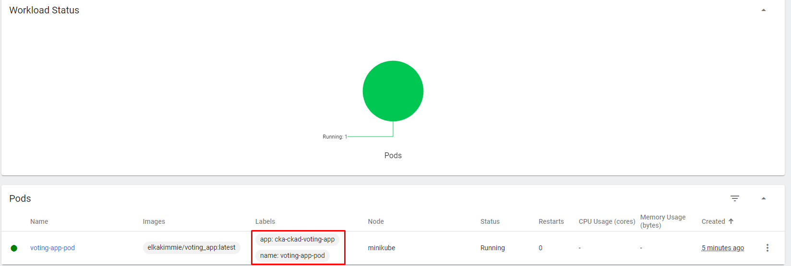

# What are we going to build?


We are going to deploy a basic distributed voting application running across multiple Docker containers to get some experience working with 3 programming languages, queues and persistent data. 

The stack we are going to use:

* front-end web app in Python which lets you vote between two options
* Redis as in memory database to collect new votes
* .NET on the backend as a worker to consume votes and store them in db
* Postgres database backed by a persistent Docker volume
* Node.js web app to render the results of the voting to end user in real time.


# Testing The App Locally using docker compose

The vote web app runs at `localhost:5002` and the results are at `localhost:5002`. I have made little tweaks for the study group :)


## Deploying the Voting App to Kubernetes using Pod and Service objects


Before writing any manifests we need to decide on the objects we need for this specific application. 

We will need 2 NodePorts (for python and nodejs) for this Voting app. We will need 3 ClusterIp Services( for Redis, postgres and .Net)for internal communication. So let's start with writing pod and service manifest files.

## Writing pod manifests

I have already builded and pushed the 3 parts of the application to dockerhub:

* python voting app: elkakimmie/voting_app:latest
* node js result page app: elkakimmie/voting_app_result:latest
* .NET app: elkakimmie/voting_app_worker:latest

Let's start writing our first pod definition.

First we need to navigate to the api definition of pod so that we can understand how to write a pod definition. Navigate to [this site ](https://kubernetes.io/docs/reference/generated/kubernetes-api/v1.28/#pod-v1-core) to find out how you can write a pod object

Once we write all the pod definitions, it's time to create the service specifications.


* port: The port on which the service will listen within the cluster.

* targetPort: The port on which the service will forward traffic to the pods selected by the service.

* nodePort: The port on each node where the service will be **accessible**. This is the port that external clients can use to access the service.


Let's create each one by one:

## 1- voting app pod and service objects

```
k apply -f voting_app.yaml;k apply -f svc-app.yaml
minikube dashboard
minikube service voting-service --url
```




## 2- redis pod and service objects


```
k apply -f redis.yaml;k apply -f svc-redis.yaml
minikube dashboard
minikube service voting-service --url
```


## 3- psql pod and service objects


```
k apply -f db.yaml; k apply -f svc-db.yaml
```


## 4- worker pod object


## 5- result pod and service objects


```
k apply -f voting_app_result.yaml ; k apply -f svc-result.yaml
```


## Bringing all the pieces together

```
m service voting-service
m service result-service --url
```


## Deploying the Voting App to Kubernetes using Deployment object


