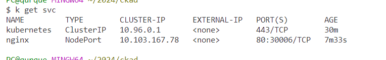
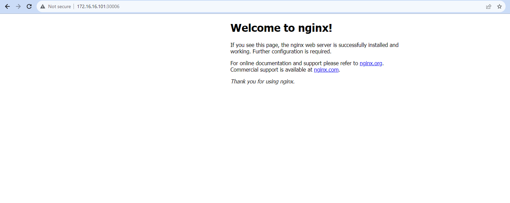
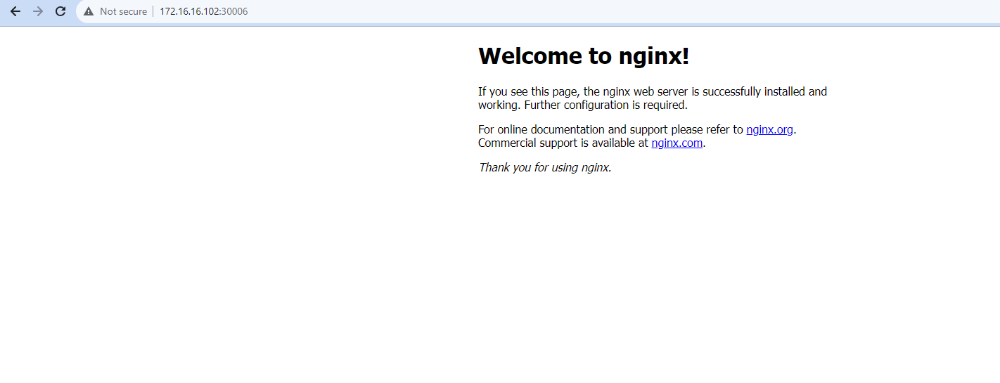
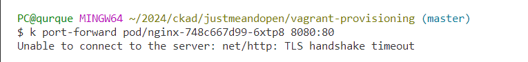
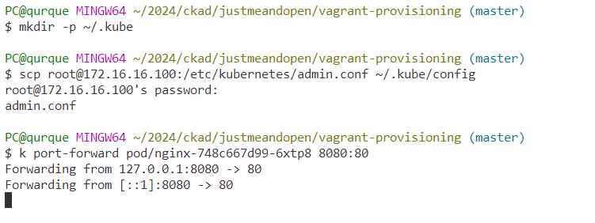
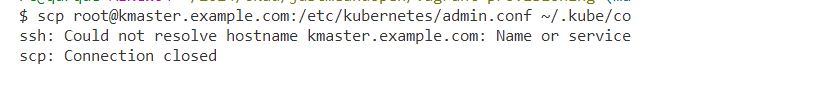
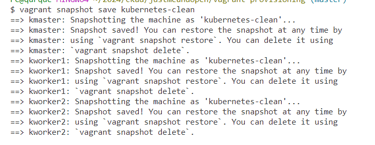

# Setting up a Vanilla Kubernetes Cluster with 1 Master and 2 Worker Nodes

## The Challenge and Solution

Studying for the Certified Kubernetes Administrator (CKA) or Certified Kubernetes Application Developer (CKAD) working with Kubernetes can be a powerful experience. However,setting up a multi-node cluster for testing and development purposes can be a daunting task, especially when dealing with a single master and multiple worker nodes. 


## Tooling and Why

While tools like Minikube or Kind are popular for local development, this guide focuses on set up a clean base for a production-grade Kubernetes playground with one master and two worker nodes using Vagrant, vbox, WSL.

## Hardware Resources

**Master Node (kmaster):**

* Memory: 2048 MB
* CPUs: 2

**Worker Nodes (kworker1 and kworker2):**

* Memory: 1024 MB each
* CPUs: 1 each

This setup will consume approximately 4096 MB of RAM and 4 CPUs. These are the allocated resources to the virtual machines. The actual usage might vary depending on the workload.

Make sure that your host machine has enough resources (RAM and CPU cores) to accommodate this virtualized Kubernetes cluster without affecting the performance of your host machine and other applications. 


If your local hardware doesn't meet the capacity required for running the Kubernetes cluster using Vagrant, VirtualBox, and the specified resource allocations, you have alternative options such as cloud-based environments

## Prerequisites and Stack Setup

Before diving into the setup process, make sure you have the following tools installed on your machine:

- [Vagrant](assets/https://www.vagrantup.com/)
- [VirtualBox](assets/https://www.virtualbox.org/)
- [Windows Subsystem for Linux (WSL)](assets/https://docs.microsoft.com/en-us/windows/wsl/)

Now, let's clone the necessary repository and start provisioning the Kubernetes cluster:

```bash
git clone https://github.com/justmeandopensource/kubernetes.git
cd kubernetes/vagrant-provisioning
vagrant up
vagrant status
```

## Managing the Cluster from Your Host Machine

One of the conveniences of this setup is the ability to manage the Kubernetes cluster directly from your host machine without SSHing into the master. Follow these steps:

```bash
rm -rf .kube
sudo vim /etc/hosts
```

Add the following entries to your `/etc/hosts` file:

```plaintext
172.16.16.100   kmaster.example.com     kmaster
172.16.16.101   kworker1.example.com    kworker1        
172.16.16.102   kworker2.example.com    kworker2 
```

```
mkdir -p $HOME/.kube
```

Now, copy the Kubernetes configuration to your local machine:

```bash
scp root@172.16.16.100:/etc/kubernetes/admin.conf ~/.kube/config
```
pasword is kubeadmin

Testing the config file: 

```bash
alias k=kubectl
k get all
```

## Testing with Nginx

To verify the cluster setup, let's deploy an Nginx pod:

```bash
k create deployment nginx --image=nginx
kubectl expose deploy nginx --type=NodePort --port 80
```

**demistifying port forwarding**

Now, you can forward the pod's port to your local machine:

```bash
k port-forward pod/nginx-<pod-id> 8080:80
```
So how to display it locally?

**step 1**- get the service port using: `k get svc`

**step 2**- get the node ip: `k get no -o wide`

**step 3**- `curl http://node-ip:service-port`



Access Nginx via your browser at `http://172.16.16.101:30006/` and `http://172.16.16.102:30006/`






## Troubleshooting Guide

### Issue 1: Unable to connect to the server: net/http: TLS handshake timeout



Solution: Remove the existing `~/.kube` directory, then create and copy the config file again.



### Issue 2: ssh: Could not resolve hostname kmaster.example.com: Name or service



*Solution*: Use the correct hostname and ensure network connectivity. If issues persist, verify the SSH configuration.


### Snapshot Management

Take advantage of Vagrant snapshots for easy management:


`vagrant halt`: Gracefully shuts down the virtual machine.

`vagrant snapshot save kubernetes-clean`: Captures the current VM state as a snapshot named "kubernetes-clean."



`vagrant snapshot list kmaster`: Lists available snapshots for the "kmaster" VM.

`vagrant up`: Restarts the virtual machine after the snapshot is taken.

`vagrant snapshot restore kworker1`: Quickly reverts the "kworker1" VM to the "kubernetes-clean" snapshot, undoing changes.

Once you take the snapshot of the cluster, you can run `vagrant up` to bring the cluster up virtual machine based on that snapshot.


## Conclusion

By following these steps and using the provided troubleshooting guide, you can have a fully functional Kubernetes playground with one master and two worker nodes for your testing and development needs.

### Under :construction: