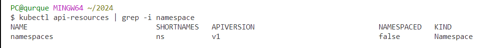
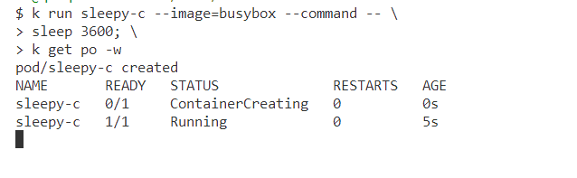
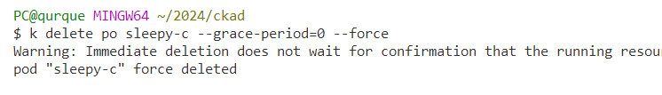
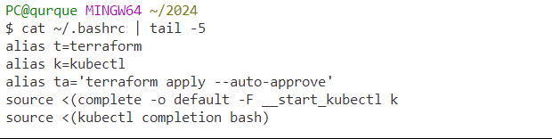
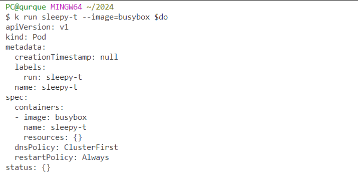

# Core-Skills

Let's get started with the core skills.

### Set the context and the namespace.
A "Context" is a combination of a cluster, user, and namespace. It is a way to specify the cluster you want to interact with, the user or authentication credentials you want to use, and the default namespace for that user. Setting a context is important because it helps you manage multiple Kubernetes clusters and switch between them easily.

**Use Cases:**  Multi-cluster Management, User and Authentication, isolate and organize resources, simplifies command-line operations.

**Hint:** Don't change the namespace, change the context as per the question. If there is a namespace add -n `namespace` to lessen the risk of error. Set context before each question using the kubectl config command, and switch between contexts using kubectl config use-context. 


## Tasks
**Duration: 20 mins**

**1-)** You have only one namespace called `tossi`.  Create a new namespace called `semvar`. 

Set the context to 'ckad', set the user field on the ckad context to admin, specify the newly created namespace simultaneously. Switch to context 'tossi'. 

<span style="color:green;">
<details open>
  <summary>
  Answer
  </summary>

```bash
k config set-context ckad --ns=semvar --user=admin

k config use-context tossi
```

</details>
</span>

<br>

**2-)** Find out the short name for namespaces

<span style="color:green;">
<details open>
  <summary>
  Answer
  </summary>

```bash

k api-resources | grep -i namespace
```


</details>
</span>

<br>

**3-)** Create a pod named `sleepy-c` using the `busybox` image, make the container sleep for `3600` seconds and display real-time updates in your terminal.
Once you see the pod status running, delete the pod object immediately.

<span style="color:green;">
<details open>
  <summary>
  Answer
  </summary>

```bash

k run sleepy-c --image=busybox --command \
-- sleep 3600; \
k get po --watch

k delete po sleepy-c --grace-period=0 --force 
#or
k delete po sleepy-c --now
```




</details>
</span>

<br>

> **Note**
> Graceful delete may take up to 30 seconds. Use it when you realize you've made a mistake and need a short window to promptly correct your actions.
`--now` is same as `--grace-period=1`,  you can use it for immediate shutdown.


**4-)** Autocompletion and alias `k` ias already preconfigured for the CKAD. 

Let's try something different. Enable autocompletion for kubectl commands in your Bash shell permanently.


<span style="color:green;">
<details open>
  <summary>
  Answer
  </summary>

```bash

echo "source <(kubectl completion bash)" >> ~/.bashrc

echo "source <(complete -o default -F __start_kubectl k" >> ~/.bashrc

k completion -h # get more info on auto completion

alias k="kubetcl" >> ~/.bashrc

# let's say you made a mistake and added a trailind space
# delete multiple lines from .bashrc on cli

sed -i -e '/source < (kubectl completion bash)/d' \
-e '/source < (k completion bash)/d' ~/.bashrc

# or you can replace in the place

sed -i -e 's/source < (kubectl completion bash)/source <(kubectl completion bash)/g' \
-e 's/source < (k completion bash)/source <(k completion bash)/g' ~/.bashrc


```


</details>
</span>

<br>


**5-)** Preview the changes that would occur if you run a pod named `sleepy-t` using the `busybox` image, making it sleep for 120/s.  Don't make any server-side changes.

Create an environment variable in a bash shell that can achieve the upper result and persist across different shell sessions.

Nope, don't create a manifest file.

<span style="color:green;">
<details open>
  <summary>
  Answer
  </summary>

```bash

--dry-run: Preview with 👇
=client: no real changes to the actual resources

# get persistence
echo 'export do="--dry-run=client -o yaml"' >> ~/.bashrc
source ~/.bashrc

# verification
k run sleepy-t --image=busybox $do

```



</details>
</span>

<br>


**6-)**
Create a Kubernetes Pod named "loop" in the "true-b" namespace. The Pod runs a container using the "busybox" image, with a looping script echoing "Hello $i times" for values of i from 1 to 10.

<span style="color:green;">
<details open>
  <summary>
  Answer
  </summary>

```bash
k create ns true-b
kubectl run loop --image=busybox \
  -n true-b $do --restart=Never \
  --command --  'for i in $(seq 1 10); \
  do echo "Hello $i times"; done' > pod.yaml
```

</details>
</span>

<br>