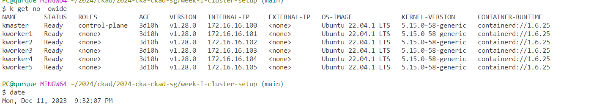
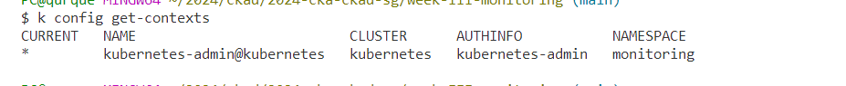
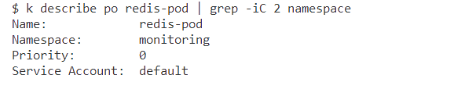
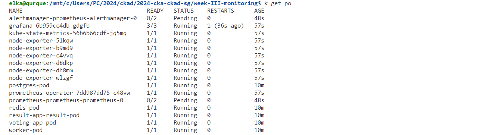
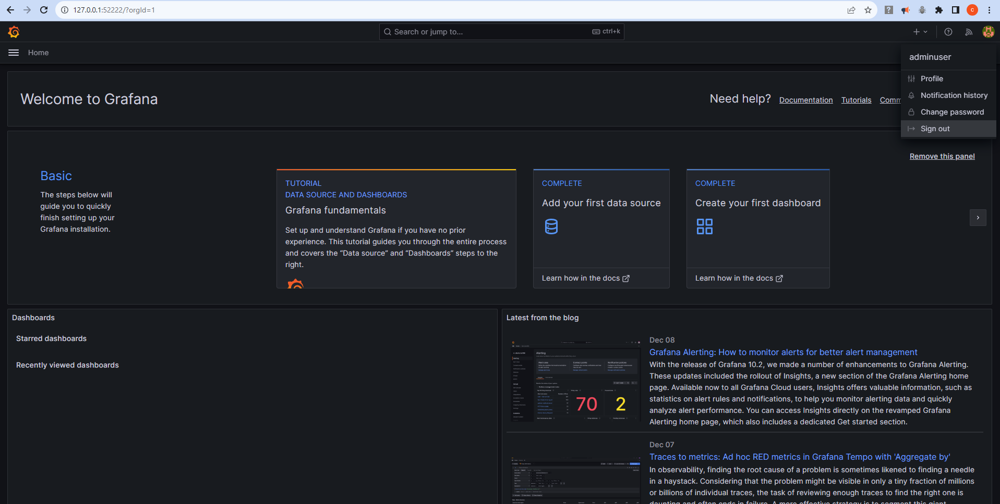
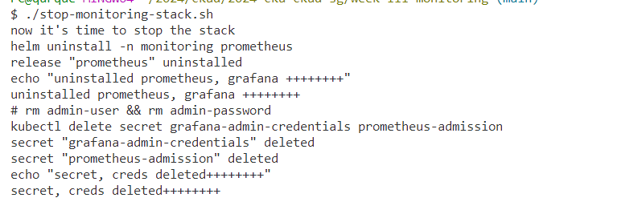

# Monitoring Stack Setup

This guide outlines the steps to set up a monitoring stack using bash scripts and Kubernetes. The monitoring stack includes Prometheus for metrics collection and Grafana for visualization.

## Prerequisites

- [kubectl](https://kubernetes.io/docs/tasks/tools/install-kubectl/)
- A running Kubernetes cluster




```sh
kubectl config set-context --current --namespace=monitoring 
```



Revive your cluster each at a time:

```sh
k apply -f ../week-II-distributed-app/voting-app/k8s-manifests/voting_app.yaml
k apply -f ../week-II-distributed-app/voting-app/k8s-manifests/svc-app.yaml

k apply -f ../week-II-distributed-app/voting-app/k8s-manifests/redis.yaml
k apply -f ../week-II-distributed-app/voting-app/k8s-manifests/svc-redis.yaml

k apply -f ../week-II-distributed-app/voting-app/k8s-manifests/db.yaml
k apply -f ../week-II-distributed-app/voting-app/k8s-manifests/svc-db.yaml

k apply -f ../week-II-distributed-app/voting-app/k8s-manifests/worker.yaml

k apply -f ../week-II-distributed-app/voting-app/k8s-manifests/voting_app_result.yaml
k apply -f ../week-II-distributed-app/voting-app/k8s-manifests/svc-result.yaml
```

**check the namespace conf**



## Installation


```bash
cd week-III-monitoring
./monitoring-stack.sh
```

```sh
k get secret
k get po -w
```

**Access Grafana locally using port-forwarding:**

```bash
kubectl port-forward grafana-6b959cc4db-gdgfb 52222:3000
```

Replace `<grafana-pod-name>` with the actual name of your Grafana pod.

## Grafana Dashboard Access

To access the Grafana dashboard, use the following credentials:

- **Username:** admin
- **Password:** p@ssword!

Update the credentials in the `makefile` if needed.







## Stopping the Services

To stop the monitoring stack services and clear the secrets, run the following command:

```bash
./stop-monitoring-stack.sh
```

