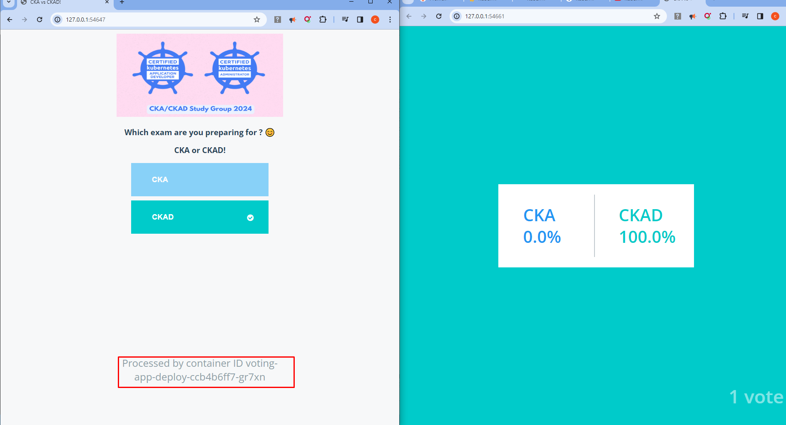
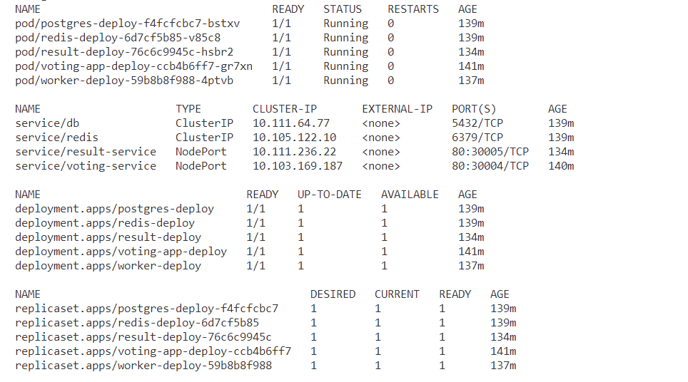

# Converting the app to deployment and packaging as Helm Chart

Create the deployment manifests

```sh
kubectl create ns monitoring
kubectl apply -f ./k8s-manifests/deployment/db-cm.yaml
kubectl apply -f ./k8s-manifests/deployment/db-secret.yaml
kubectl apply -f ./k8s-manifests/deployment/pv.yaml
kubectl apply -f ./k8s-manifests/deployment/voting-app.yaml
kubectl apply -f ./k8s-manifests/deployment/svc-app.yaml
kubectl apply -f ./k8s-manifests/deployment/redis.yaml
kubectl apply -f ./k8s-manifests/deployment/svc-redis.yaml
kubectl apply -f ./k8s-manifests/deployment/db.yaml
kubectl apply -f ./k8s-manifests/deployment/svc-db.yaml
kubectl apply -f ./k8s-manifests/deployment/worker-app.yaml
kubectl apply -f ./k8s-manifests/deployment/result.yaml
kubectl apply -f ./k8s-manifests/deployment/svc-result.yaml
minikube service voting-service --url -n monitoring
minikube service result-service --url -n monitoring
```







**Running the Voting app Locally**

Make sure you have helm installed.

```sh
helm list
helm pull oci://registry-1.docker.io/elkakimmie/cka-ckad-sg --version 0.1.0
helm install sg oci://registry-1.docker.io/elkakimmie/cka-ckad-sg --version 0.1.0
```

